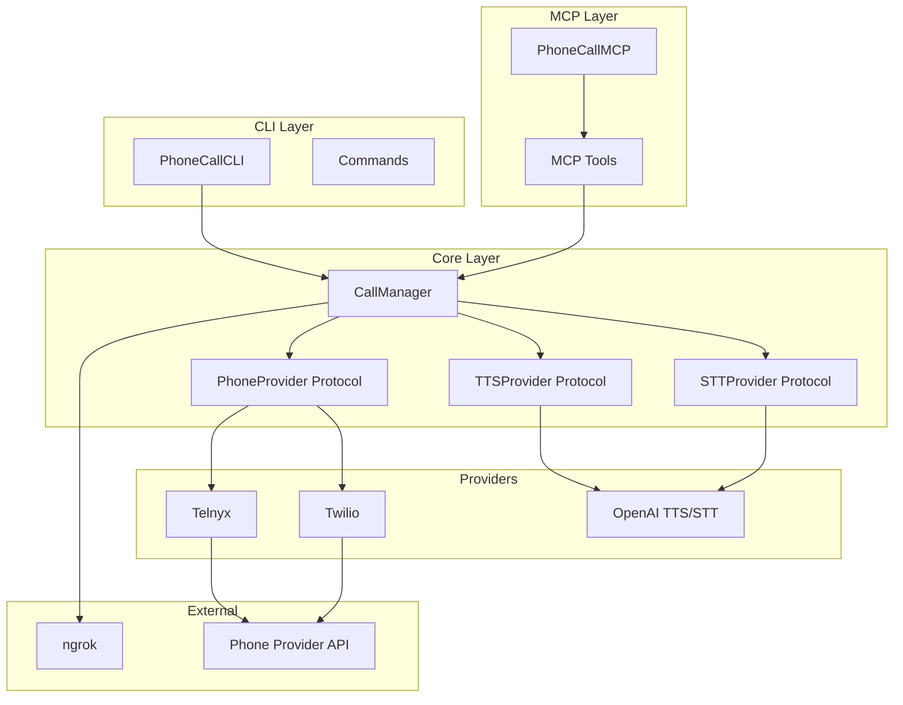

# 📞 RingRing

**Minimal Swift CLI + MCP server that lets Claude call you on the phone.**

Start a task, walk away. Your phone/watch rings when Claude is done, stuck, or needs a decision.

```
   🤖                     📡                          📱
Claude  ────────►  RingRing  ────────►  Phone Provider  ────────►  You
                     (Swift)        (ngrok tunnel)      (Telnyx/Twilio)
```

- **Minimal plugin** - Does one thing: call you on the phone. No crazy setups.
- **Multi-turn conversations** - Talk through decisions naturally.
- **Works anywhere** - Smartphone, smartwatch, or even landline!
- **Tool-use composable** - Claude can e.g. do a web search while on a call with you.
- **Swift + MCP** - Built with Swift 6, Commander, and MCP SDK following Peekaboo architecture.

---

## Quick Start

### 1. Get Required Accounts

You'll need:
- **Phone provider**: [Telnyx](https://telnyx.com) (recommended) or [Twilio](https://twilio.com)
- **OpenAI API key**: For speech-to-text and text-to-speech
- **ngrok account**: Free at [ngrok.com](https://ngrok.com) (for webhook tunneling)

### 2. Interactive Setup

```bash
cd /Volumes/Main\ SSD/Developer/RingRing
swift run phonecall init
```

Follow the prompts to enter your credentials.

### 3. Make a Test Call

```bash
swift run phonecall call "Hello! I wanted to tell you something."
```

### 4. Use as MCP Server

Run as an MCP server for Claude Desktop/Cursor:

```bash
swift run phonecall mcp
```

Add to your Claude Desktop config (`~/.claude/settings.json`):

```json
{
  "mcpServers": {
    "phonecall": {
      "command": "/path/to/.build/debug/phonecall",
      "args": ["mcp"],
      "env": {
        "CALLME_PHONE_PROVIDER": "telnyx",
        "CALLME_PHONE_ACCOUNT_SID": "your-connection-id",
        "CALLME_PHONE_AUTH_TOKEN": "your-api-key",
        "CALLME_PHONE_NUMBER": "+15551234567",
        "CALLME_USER_PHONE_NUMBER": "+15559876543",
        "CALLME_OPENAI_API_KEY": "sk-...",
        "CALLME_NGROK_AUTHTOKEN": "your-ngrok-token"
      }
    }
  }
}
```

---

## CLI Commands

| Command | Description |
|---------|-------------|
| `phonecall init` | Interactive setup wizard |
| `phonecall call <message>` | Make a phone call with a message |
| `phonecall status` | Check configuration status |
| `phonecall webhook start` | Start webhook server manually |
| `phonecall mcp` | Run as MCP server (default) |

---

## MCP Tools

| Tool | Description |
|------|-------------|
| `initiate_call` | Start a phone call with the user |
| `continue_call` | Continue an active call with a follow-up message |
| `speak_to_user` | Speak without waiting for response |
| `end_call` | End an active call with a closing message |

---

## Environment Variables

| Variable | Required | Default | Description |
|----------|----------|---------|-------------|
| `CALLME_PHONE_PROVIDER` | Yes | `telnyx` | Phone provider: `telnyx` or `twilio` |
| `CALLME_PHONE_ACCOUNT_SID` | Yes | - | Telnyx: Connection ID, Twilio: Account SID |
| `CALLME_PHONE_AUTH_TOKEN` | Yes | - | Telnyx: API Key, Twilio: Auth Token |
| `CALLME_PHONE_NUMBER` | Yes | - | Phone number Claude calls FROM (E.164) |
| `CALLME_USER_PHONE_NUMBER` | Yes | - | Your phone number to receive calls (E.164) |
| `CALLME_OPENAI_API_KEY` | Yes | - | OpenAI API key (for TTS and STT) |
| `CALLME_NGROK_AUTHTOKEN` | No | - | ngrok auth token for webhook tunneling |
| `CALLME_PORT` | No | `3333` | Local HTTP server port |
| `CALLME_TTS_VOICE` | No | `onyx` | OpenAI voice: `alloy`, `echo`, `fable`, `onyx`, `nova`, `shimmer` |
| `CALLME_TRANSCRIPT_TIMEOUT_MS` | No | `180000` | Timeout for user speech (3 minutes) |
| `CALLME_STT_SILENCE_DURATION_MS` | No | `800` | Silence duration to detect end of speech |

---

## Project Structure

```
RingRing/
├── Package.swift                 # Swift package definition
├── Sources/
│   ├── Core/                    # Library (no CLI/MCP deps)
│   │   ├── PhoneProvider/       # Phone provider protocols
│   │   ├── Telnyx/             # Telnyx implementation
│   │   ├── Twilio/             # Twilio implementation
│   │   ├── TTS/                # Text-to-speech
│   │   ├── STT/                # Speech-to-text
│   │   ├── Webhook/            # Audio utilities
│   │   ├── Config/             # Configuration loader
│   │   ├── Models/             # Data models
│   │   └── CallManager.swift   # Main call manager
│   ├── CLI/                    # CLI commands (Commander)
│   │   └── PhoneCallCLI.swift
│   ├── MCP/                    # MCP server
│   │   └── PhoneCallMCP.swift
│   └── Executable/             # Main entry point
│       └── main.swift
├── Tests/                      # Swift tests
├── docs/                       # Documentation
│   ├── API.md                  # API reference
│   ├── ARCHITECTURE.md         # Architecture docs
│   └── MCP.md                  # MCP tool docs
└── README.md
```

---

## Building

```bash
# Debug build
swift build

# Release build
swift build -c release

# Run tests
swift test

# Build with Swift 6 features
swift build -Xswiftc -enable-experimental-feature StrictConcurrency
```

---

## Installation

### Homebrew (recommended)

```bash
brew tap RyanLisse/tap
brew install phonecall
```

### From Source

```bash
git clone https://github.com/RyanLisse/RingRing.git
cd RingRing
swift build -c release

# Link to PATH
ln -s $(swift build -c release --show-bin-path)/phonecall /usr/local/bin/phonecall
```

---

## Architecture

See [docs/ARCHITECTURE.md](docs/ARCHITECTURE.md) for detailed architecture documentation.



---

## Costs

| Service | Telnyx | Twilio |
|---------|--------|--------|
| Outbound calls | ~$0.007/min | ~$0.014/min |
| Phone number | ~$1/month | ~$1.15/month |

Plus OpenAI costs (same for both providers):
- **Speech-to-text**: ~$0.006/min (Whisper)
- **Text-to-speech**: ~$0.02/min (TTS)

**Total**: ~$0.03-0.04/minute of conversation

---

## Troubleshooting

### Claude doesn't use the tool
1. Check all required environment variables are set
2. Restart Claude Desktop after adding the MCP server
3. Try explicitly: "Call me to discuss the next steps when you're done."

### Call doesn't connect
1. Check the MCP server logs (stderr)
2. Verify your phone provider credentials are correct
3. Make sure ngrok can create a tunnel

### Audio issues
1. Ensure your phone number is verified with your provider
2. Check that the webhook URL in your provider dashboard matches your ngrok URL

### ngrok errors
1. Verify your `CALLME_NGROK_AUTHTOKEN` is correct
2. Check if you've hit ngrok's free tier limits
3. Try a different port with `CALLME_PORT=3334`

---

## Development

```bash
# Run in debug mode
swift run phonecall call "Hello"

# Run tests
swift test --enable-code-coverage

# Lint
swiftformat .
swiftlint lint

# Generate coverage report
xcrun llvm-cov report --instr-profile=.build/debug/codecov/default.profdata
```

---

## Contributing

1. Fork the repo
2. Create your feature branch (`git checkout -b feature/amazing-feature`)
3. Commit your changes (`git commit -m 'Add amazing feature'`)
4. Push to the branch (`git push origin feature/amazing-feature`)
5. Open a Pull Request

---

## License

MIT License - see [LICENSE](LICENSE) for details.

---

## Acknowledgments

- Original [call-me](https://github.com/ZeframLou/call-me) TypeScript implementation
- [Peekaboo](https://github.com/steipete/peekaboo) architecture and patterns
- [Swift MCP SDK](https://github.com/modelcontextprotocol/swift-sdk) for MCP support
- [Commander](https://github.com/steipete/Commander) for CLI parsing

---

Made with 🦁 in the Netherlands
