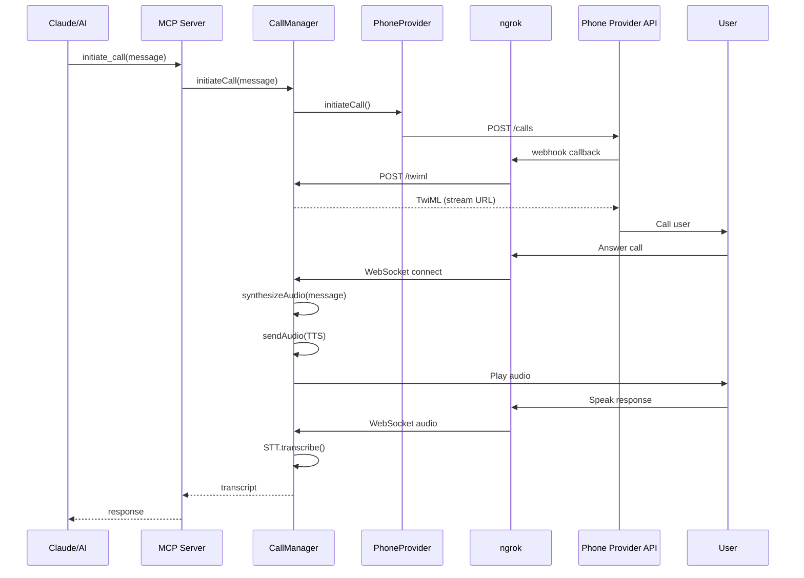
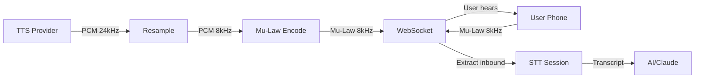

# RingRing Architecture

## Overview

RingRing is a Swift CLI + MCP server that allows AI assistants to make phone calls. It follows the **Peekaboo architecture** - a clean separation between core library, CLI layer, and MCP server.

```
┌─────────────────────────────────────────────────────────────────┐
│                         User Layer                            │
├─────────────────────────────────────────────────────────────────┤
│  CLI (Commander)              MCP Server                      │
│  ┌──────────────┐            ┌──────────────┐                │
│  │ InitCommand  │            │ Tools       │                │
│  │ CallCommand  │            │ - initiate  │                │
│  │ StatusCmd    │            │ - continue  │                │
│  └──────────────┘            │ - speak     │                │
│                             │ - end_call  │                │
│                             └──────────────┘                │
└─────────────┬─────────────────────────┬───────────────────────┘
              │                         │
              └──────────┬──────────────┘
                         │
┌─────────────────────────────────────────────────────────────────┐
│                      Core Layer                              │
│  ┌─────────────────────────────────────────────────────────┐  │
│  │                   CallManager                         │  │
│  │  - Manages active calls                              │  │
│  │  - Coordinates providers                              │  │
│  │  - HTTP/WebSocket server                              │  │
│  └─────────────────────────────────────────────────────────┘  │
│           │                    │                    │          │
│  ┌────────▼─────────┐ ┌────▼─────┐ ┌─────────▼────┐     │
│  │  PhoneProvider    │ │ TTS      │ │ STT          │     │
│  │  Protocol        │ │ Provider │ │ Provider     │     │
│  └────────┬─────────┘ └────┬─────┘ └─────────▲────┘     │
│           │                  │                │              │
│  ┌────────▼─────────┐ ┌────▼─────┐ ┌─────────▼────┐     │
│  │ TelnyxProvider  │ │ OpenAI   │ │ OpenAI       │     │
│  │ TwilioProvider   │ │ TTS      │ │ Realtime STT │     │
│  └──────────────────┘ └──────────┘ └──────────────┘     │
└─────────────────────────────────────────────────────────────────┘
                            │
┌─────────────────────────────────────────────────────────────────┐
│                     External Services                         │
│  ┌──────────────┐  ┌──────────────┐  ┌──────────────┐     │
│  │ Telnyx/Twilio│  │  ngrok       │  │  OpenAI      │     │
│  │  API         │  │  Tunnel      │  │  API         │     │
│  └──────────────┘  └──────────────┘  └──────────────┘     │
└─────────────────────────────────────────────────────────────────┘
```

## Package Structure

```
RingRing/
├── Package.swift                 # Swift 6 package definition
│
├── Sources/
│   ├── Core/                    # Core library (no CLI/MCP deps)
│   │   ├── Models/              # Data models
│   │   ├── PhoneProvider/       # Phone provider protocols
│   │   ├── Telnyx/             # Telnyx implementation
│   │   ├── Twilio/             # Twilio implementation
│   │   ├── TTS/                # Text-to-speech (OpenAI)
│   │   ├── STT/                # Speech-to-text (OpenAI)
│   │   ├── Webhook/            # Audio processing utilities
│   │   ├── Config/             # Configuration loader
│   │   └── CallManager.swift   # Main call orchestrator
│   │
│   ├── CLI/                    # CLI commands (uses Commander)
│   │   └── PhoneCallCLI.swift
│   │
│   ├── MCP/                    # MCP server implementation
│   │   └── PhoneCallMCP.swift
│   │
│   └── Executable/             # Main entry point
│       └── main.swift
│
├── Tests/                      # Swift tests
└── docs/                       # Documentation
```

## Key Components

### CallManager

The `CallManager` is the central orchestrator that:

1. **Manages Call State** - Tracks active calls, WebSocket connections, and conversation history
2. **Coordinates Providers** - Uses PhoneProvider, TTSProvider, and STTProvider
3. **Runs HTTP/WebSocket Server** - Handles webhooks and media streaming
4. **Implements Call Flow** - Speaks and listens in a turn-based conversation

#### Call Flow



### Phone Providers

Both Telnyx and Twilio implement the `PhoneProvider` protocol:

#### Telnyx Flow

1. **Initiate Call**: `POST /v2/calls` with webhook URL
2. **Webhook**: JSON with `call.answered` event
3. **Start Streaming**: `POST /v2/calls/{id}/actions/stream`
4. **Hangup**: `POST /v2/calls/{id}/actions/hangup`

#### Twilio Flow

1. **Initiate Call**: `POST /2010-04-01/Accounts/{sid}/Calls.json`
2. **Webhook**: `POST` to webhook URL with form data
3. **Stream Connect**: Return TwiML with `<Stream>` element
4. **Hangup**: `POST /Calls/{sid}.json` with `Status=completed`

### Audio Pipeline



#### Audio Processing

1. **TTS Output**: OpenAI returns 24kHz 16-bit PCM
2. **Resampling**: Downsample to 8kHz (3:1)
3. **Mu-Law Encoding**: Convert to 8-bit mu-law (required by phone providers)
4. **Chunking**: Split into 160-byte chunks (20ms at 8kHz)
5. **Sending**: Send via WebSocket with 18ms spacing

### OpenAI Realtime STT

Uses OpenAI's Realtime API for streaming speech-to-text:

1. **WebSocket Connect**: Connect to `wss://api.openai.com/v1/realtime`
2. **Session Update**: Configure VAD, silence detection
3. **Send Audio**: Base64-encoded mu-law audio
4. **Receive Transcript**: VAD detects end of speech, sends transcript

#### VAD Configuration

```json
{
  "turn_detection": {
    "type": "server_vad",
    "threshold": 0.5,
    "prefix_padding_ms": 300,
    "silence_duration_ms": 800
  }
}
```

## Swift 6 Concurrency

RingRing uses Swift 6 strict concurrency:

- `@MainActor` for CLI and MCP entry points
- `actor` for stateful components (`CallManager`, `Configuration`, provider instances)
- `Sendable` conformance for all data models
- Async/await throughout for clean concurrency

### Concurrency Model

```swift
// Core module uses actors for state isolation
public actor CallManager { ... }
public actor Configuration { ... }
public actor OpenAIRealtimeSTT { ... }
public actor TelnyxProvider { ... }
public actor TwilioProvider { ... }

// CLI and MCP run on MainActor
@MainActor
public struct PhoneCallCLI { ... }

@MainActor
public final class PhoneCallMCP { ... }
```

## Security

### Webhook Signature Validation

**Twilio**: HMAC-SHA1 signature
- Compute SHA1 of `(url + body)` with auth token
- Compare with `X-Twilio-Signature` header

**Telnyx**: Ed25519 signature
- Verify with public key (`CALLME_TELNYX_PUBLIC_KEY`)
- Uses `Telnyx-Signature-Ed25519` header

### WebSocket Authentication

- Token-based authentication
- Token generated at call initiation
- Included in WebSocket URL: `/media-stream?token=<token>`

### ngrok Compatibility

For ngrok free tier:
- Signature validation may fail due to header modification
- Fallback mode accepts connections without strict validation
- Recommended: Use paid ngrok tier or validate locally

## Error Handling

```swift
public enum RingRingError: Error, LocalizedError {
    case missingConfiguration(String)
    case providerError(String)
    case networkError(String)
    case callNotFound(String)
    case callTimeout
    case callHungUp
    case transcriptionError(String)
    case synthesisError(String)
    case webhookSignatureInvalid
    case authenticationFailed
}
```

## Performance Considerations

### Latency Optimization

1. **Parallel TTS Generation**: Generate audio while establishing call connection
2. **Streaming TTS**: Send audio chunks as they're generated (optional)
3. **Pre-encoded Mu-Law**: Reduce encoding latency
4. **WebSocket Reuse**: Keep connections open for multi-turn calls

### Memory Management

1. **Audio Chunking**: Process audio in small chunks (20ms)
2. **Connection Pooling**: Reuse WebSocket connections
3. **Call Cleanup**: Immediately release resources on hangup

## Testing Strategy

### Unit Tests

- Provider implementations
- Audio processing (resampling, mu-law encoding)
- Configuration loading

### Integration Tests

- Full call flow with mock providers
- WebSocket message handling
- Webhook processing

### E2E Tests

- Real Telnyx/Twilio calls
- Live OpenAI TTS/STT
- End-to-end conversation

## Dependencies

| Package | Version | Purpose |
|---------|---------|---------|
| Commander | path | CLI argument parsing |
| swift-sdk | 0.10.2+ | MCP protocol |
| swift-nio | 2.65.0+ | HTTP/WebSocket server |
| Foundation | stdlib | Core APIs |

## Future Enhancements

1. **More Phone Providers**: Bandwidth, Plivo
2. **Custom TTS/STT**: Whisper local, Coqui TTS
3. **Call Recording**: Save conversations to file
4. **Voice Cloning**: Clone user's voice for responses
5. **SSML Support**: Rich speech synthesis with prosody
6. **Multi-party Calls**: Conference calls
7. **SMS Integration**: Send text messages
